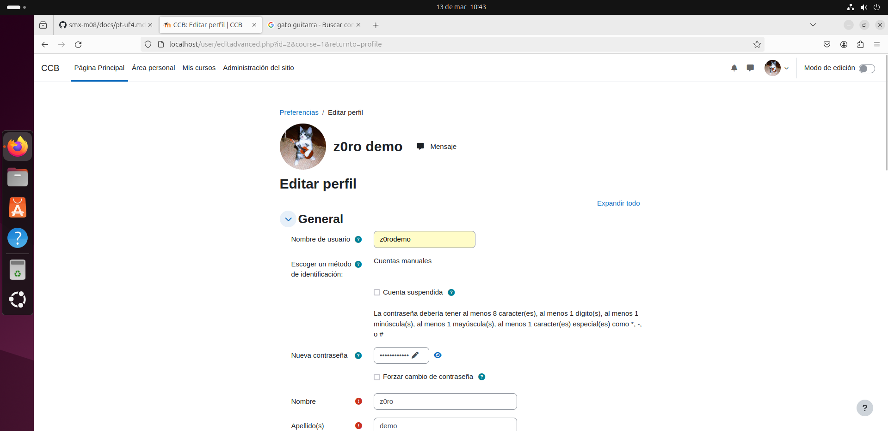
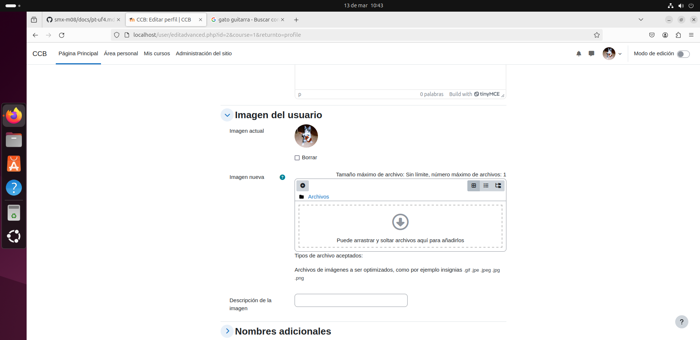
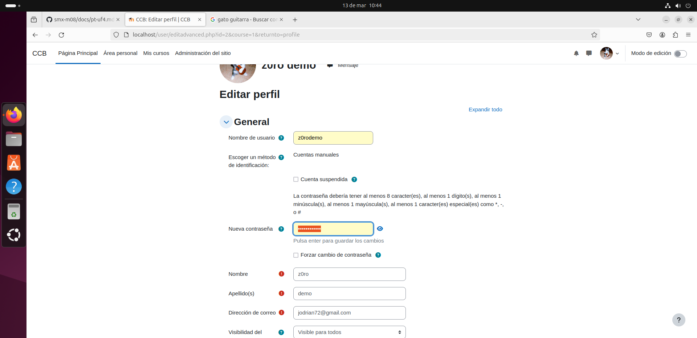

# Moodle manual
## Presentación
Hola, a continuación explicaré mediante mis propias palabras y mis capturas de pantalla la formación de mi Moodle.
## Configuración de usuario
A continuación mostraré la configuración del nombre de usuario, imagen de perfil y canbio de contraseña.

