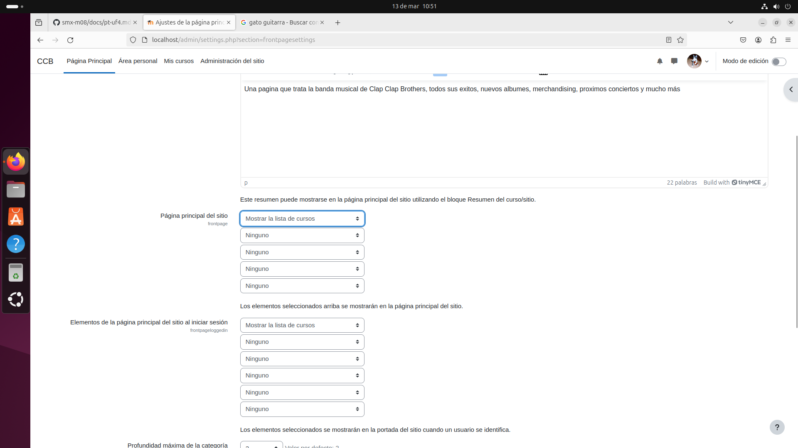
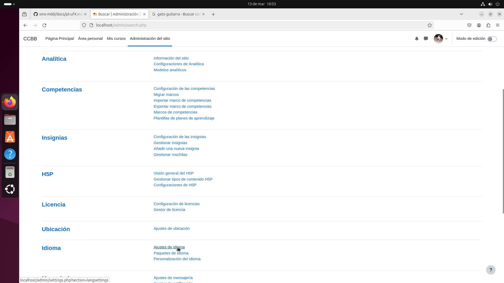
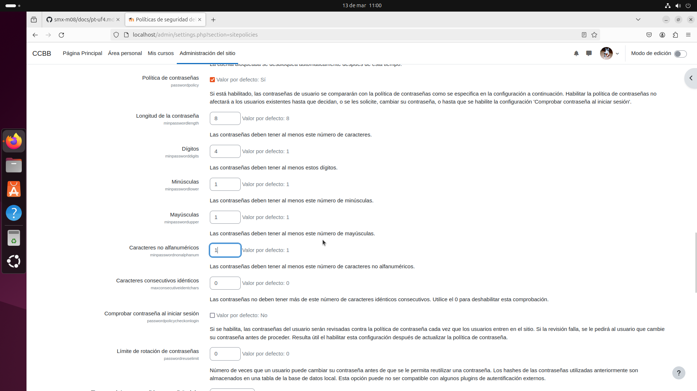
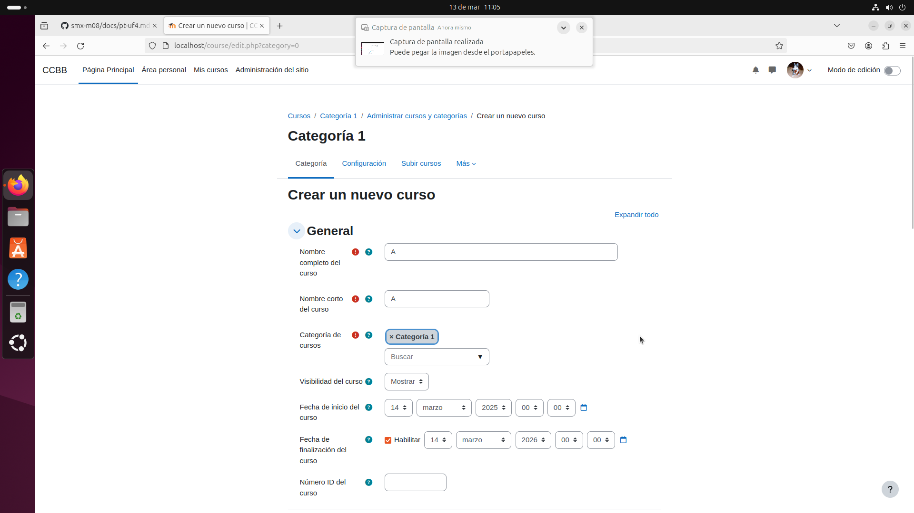
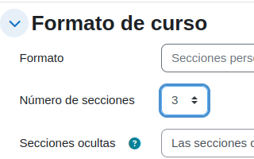

# Moodle manual
## Presentación
Hola, a continuación explicaré mediante mis propias palabras y mis capturas de pantalla la formación de mi Moodle.
## Configuración de usuario
A continuación mostraré la configuración del nombre de usuario, imagen de perfil y canbio de contraseña.

## Configuración inicial de la pagina
Se mostrara el nombre de la pagina, la ubicación y el idioma.

Ubicación

Idioma

## Configuración de la contraseña obligatoria de los usuarios

## Creación del curso A con 3 secciones

## Creación del curso B

