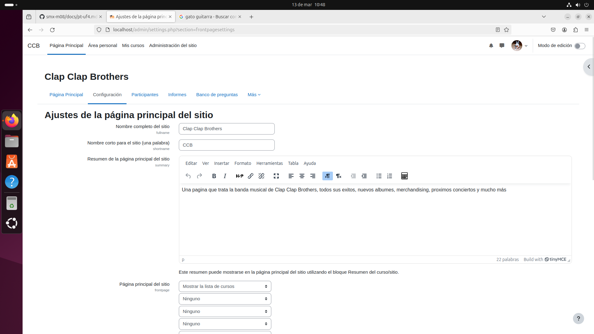
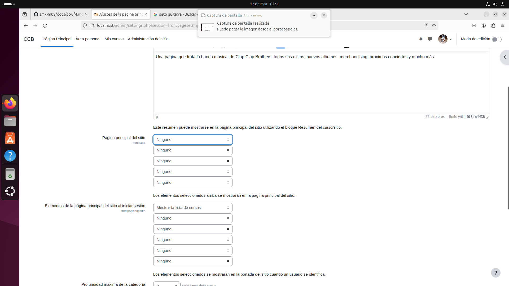
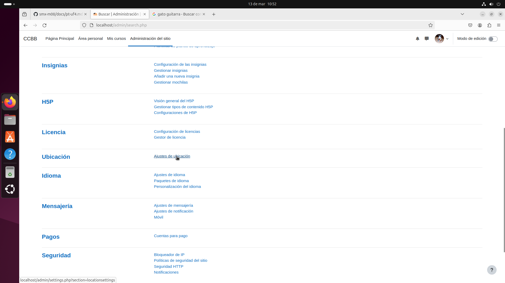
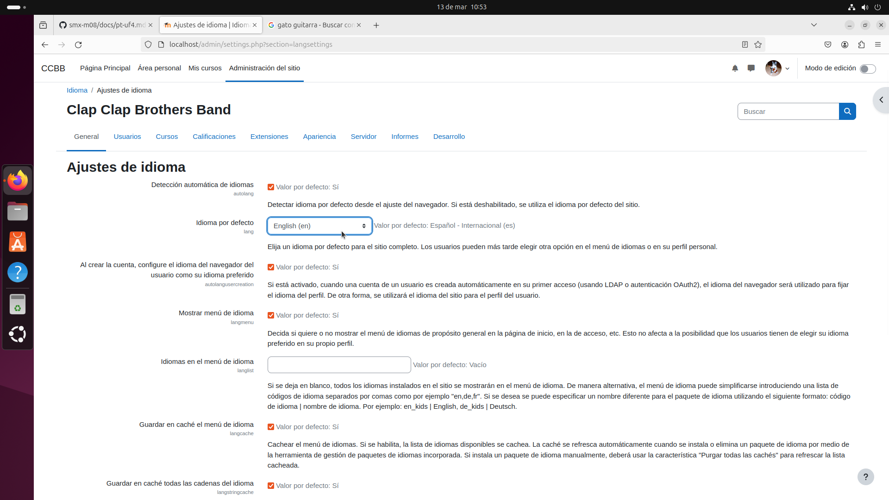
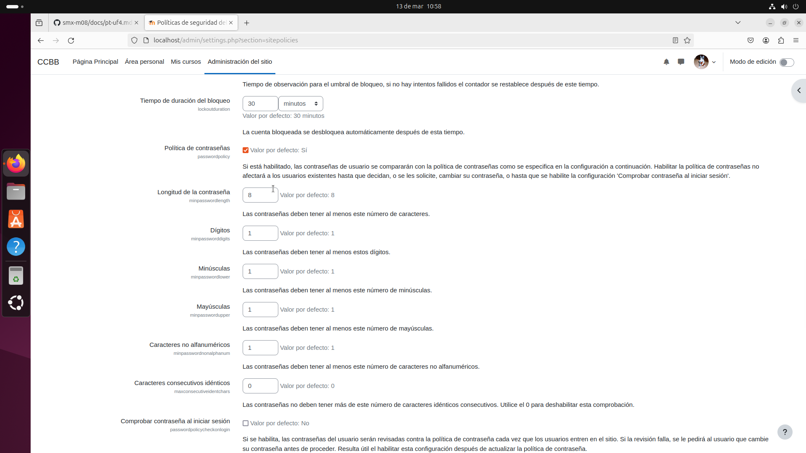
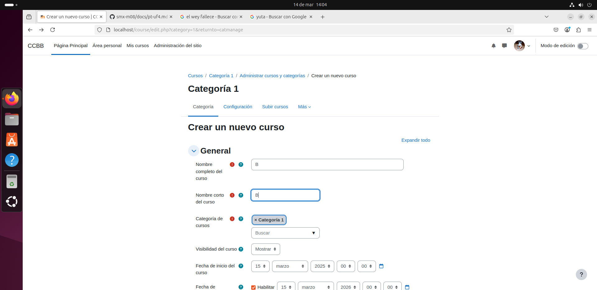

# Moodle manual
## Presentación
Hola, a continuación explicaré mediante mis propias palabras y mis capturas de pantalla la formación de mi Moodle.
## Configuración de usuario
A continuación mostraré la configuración del nombre de usuario, imagen de perfil y canbio de contraseña.

## Configuración inicial de la pagina
Se mostrara el nombre de la pagina, la ubicación y el idioma.

Ubicación

Idioma

## Configuración de la contraseña obligatoria de los usuarios

## Creación del curso A con 3 secciones

## Creación del curso B

### Resultado final de la creación de curso  A y B

El curso A con 3 secciones

## Añadir un archivo al curso

## Cambio de lenguaje

## Añadir un usuario llamado Bob

## Generar 10 usuarios a la vez

### Borrar 2 usuarios

### Matricular usuarios

### Asignar a Bob como profesor

## Resultado de los participantes del curso

### Curso A

### Curso B

## Subir actividad al B

### Entregada

### Qualificada

## Hacer que el A solo sea acceso a invitados

## Hacer que solo se pueda matricular en el B manualmente como profesor

### Resultado

## Agregar 2 UF y 2 NF con actividades y cuestionario

## Entregar todas desde un alumno
Solo se muestra una actividad pero basicamente asi con todas

## Calificar todo con nota máxima

## Añadir insignia al alumno

## Copia de seguridad

## Añadir logo

## Cambiar tema

# Hasta aqui el manual

